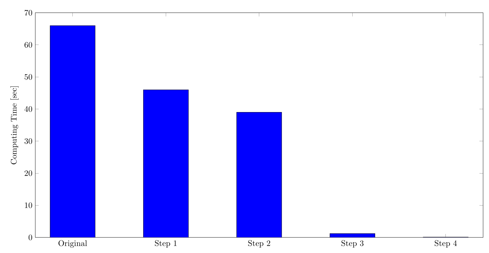

# Opmizing C++ - Brute Force Problem

I write this article to show some optimizations in C++ can accelerate
enormously the execution of sequential codes. In this case, I show a solution I
propose to a HackerRank problem for finding a Magic Square that minimizes a
cost function (given an magic square as a guess). I will show how I could
reduce the computing time from 1min 5sec to about 0.3 seconds (x200 of speedup)
simply with very simple optimizations and without any use of multithreading or
any kind of parallelism. The steps that I show can be cloned from my GitHub
repository and compiled and executed. Please fill free to try any optimization
and share and note the first version of the code is extremely inefficient for
didactic purposes, most good programmers don't do these things on the first
trial.

This is a problem that I tried to solve with brute force. For this, 9! = 362880
magic squares should be computed. Note that a magic square is a 3 x 3 array
with non repeated integers in the range [1, 9] were the sum of each row, column
and the two diagonal is the same. HackerRank gives 2 seconds for testing the
execution so this 362880 squares should be evaluated quickly for finding the
one that minimizes a cost function.

The first initial version of my code was plenty of STL vectors since HackerRank
generally gives you templates with them for starting writing your . working
version of my first code is the one below. In the main function, we call once
to formingMagicSquare, this function returns the minimum cost for a particular
guess. As you can notice there are 9 nested for loops used to build the 9! =
362880 magic squares that are trials. The function checks if they are magic
squares by definition and computes the cost of each of them storing the minimum
value.

```cpp
#include <bits/stdc++.h>

using namespace std;

bool isMagic(vector<vector<int>> s)
{
    // Verify that elements are not repeated
    vector<int> aux = {s[0][0], s[0][1], s[0][2],
                       s[1][0], s[1][1], s[1][2],
                       s[2][0], s[2][1], s[2][2]};

    sort(aux.begin(), aux.end());
    for (int i = 0; i < 8; i++) {
        if (aux[i] == aux[i + 1]) return false;
    }

    int sum0 = s[0][0] + s[0][1] + s[0][2];

    int sum = s[1][0] + s[1][1] + s[1][2]; if (sum != sum0) return false;
    sum = s[2][0] + s[2][1] + s[2][2]; if (sum != sum0) return false;

    sum = s[0][0] + s[1][0] + s[2][0]; if (sum != sum0) return false;
    sum = s[0][1] + s[1][1] + s[2][1]; if (sum != sum0) return false;
    sum = s[0][2] + s[1][2] + s[2][2]; if (sum != sum0) return false;

    sum = s[0][0] + s[1][1] + s[2][2]; if (sum != sum0) return false;
    sum = s[2][0] + s[1][1] + s[0][2]; if (sum != sum0) return false;

    return true;
}

unsigned int costBetweenSquares(vector<vector<int>> s1,
                                vector<vector<int>> s2)
{
    unsigned int cost{};
    for (int i = 0; i < 3; i++)
        for (int j = 0; j < 3; j++)
            cost += abs(s1[i][j] - s2[i][j]);
    return cost;
}

unsigned int formingMagicSquare(vector<vector<int>> s){
    unsigned int minCost{1000};
    for (int a1 = 1; a1 <= 9; a1++) {
    for (int a2 = 1; a2 <= 9; a2++) {
    for (int a3 = 1; a3 <= 9; a3++) {
    for (int a4 = 1; a4 <= 9; a4++) {
    for (int a5 = 1; a5 <= 9; a5++) {
    for (int a6 = 1; a6 <= 9; a6++) {
    for (int a7 = 1; a7 <= 9; a7++) {
    for (int a8 = 1; a8 <= 9; a8++) {
    for (int a9 = 1; a9 <= 9; a9++) {
        vector<vector<int>> trialSquare = {
            {a1, a2, a3},
            {a4, a5, a6},
            {a7, a8, a9}};
        bool isMagicF = isMagic(trialSquare);
        if (isMagicF) {
            unsigned int cost = costBetweenSquares(trialSquare, s);
            if (cost < minCost) {
                minCost = cost;
            }
        }
    }}}}}}}}}

    return minCost;
}

int main(){
    vector<vector<int>> square1 = {{5, 3, 4}, {1, 5, 8}, {6, 4, 2}};
    cout << formingMagicSquare(square1) << endl;
    return 0;
}
```

Compiling with GCC 9.3 using -O3 on my machine with an Intel i5-9300H I get:

```cpp
$ g++ main_1.cpp -o main_1
$ time ./main_1
7
real    1m4.648s
user    1m4.617s
sys     0m0.004s
```

Note that 7 is the correct answer for this problem but the computing time is
much bigger than 2 seconds (not enough fast to be submitted to HackerRank).

We can start attacking isMagic and costBetweenSquare which are called 9! times.
The first obvious thing is the copy constructor of the trialSquare that is
executed in both functions. Note that the squares are passed by value and not
by reference:

```cpp
bool isMagic(vector<vector<int>> s) {...}

unsigned int costBetweenSquares(vector<vector<int>> s1,
                                vector<vector<int>> s2) {...}
```

Referencing the vectors as:

```cpp
bool isMagic(const vector<vector<int>> &s) {...}

unsigned int costBetweenSquares(const vector<vector<int>>& s1,
                                const vector<vector<int>>& s2) {...}
```

And after re-running it we have:

```cpp
$ g++ main_2.cpp -o main_2
$ time ./main_2
7
real    0m46.803s
user    0m46.711s
sys     0m0.010s
```

A speedup of x1.41 is achieved, note the importance of taking into account the
constructor and destructors of these small classes that affect substantially
the performance when they are done repeatedly.

Let take a look at isMagic, the first part checks that all the elements in the
trialSquare are not repeated. Note that I am using the sort algorithm of STL,
this algorithm is O(n log (n)) but for 3 x 3 = 9 elements brute force can be
faster even if the algorithm is O(n^2). Let see if this hypothesis is right by
changing that part to a brute force solution:

```cpp
bool isMagic(const vector<vector<int>>& s)
{
    // Verify that elements are not repeated
    vector<int> aux = {s[0][0], s[0][1], s[0][2], s[1][0], s[1][1], s[1][2], s[2][0], s[2][1], s[2][2]};

    for (int i = 0; i < 8; i++)
        for (int j = i + 1; j < 9; j++)
            if (aux[i] == aux[j]) return false;

    ...
```

Executing again:

```cpp
$ g++ main_3.cpp -o main_3 -O3
$ time ./main_3
7
real    0m39.434s
user    0m39.421s
sys     0m0.001s
```

A speedup of about x1.6, not bad.

It is time now to improve the data structure for storing the magic squares,
HackerRank use vector<vector<int>> for storing the 9 components. Unfortunately,
this data is not contiguous in memory and the bringing the 9 value is bigger
than bring a consecutive chunk of 9 integers. By replacing it with a C-style
array like:

```cpp
bool isMagic(const int s[9])
{
    // Verify that elements are not repeated
    for (int i = 0; i < 8; i++)
        for (int j = i + 1; j < 9; j++)
            if (s[i] == s[j]) return false;

    const int sum0 = s[0] + s[1] + s[2];

    if (s[3] + s[4] + s[5] != sum0) return false;
    if (s[6] + s[7] + s[8] != sum0) return false;

    if (s[0] + s[3] + s[6] != sum0) return false;
    if (s[1] + s[4] + s[7] != sum0) return false;
    if (s[2] + s[5] + s[8] != sum0) return false;

    if (s[0] + s[4] + s[8] != sum0) return false;
    if (s[6] + s[4] + s[2] != sum0) return false;

    return true;
}

unsigned int costBetweenSquares(const int s1[9], const int s2[9])
{
    unsigned int cost{};
    for (int i = 0; i < 9; i++)
            cost += abs(s1[i] - s2[i]);
    return cost;
}

unsigned int formingMagicSquare(const int s[9])
{
    unsigned int minCost{1000};
    for (int a1 = 1; a1 <= 9; a1++) {
    for (int a2 = 1; a2 <= 9; a2++) {
    for (int a3 = 1; a3 <= 9; a3++) {
    for (int a4 = 1; a4 <= 9; a4++) {
    for (int a5 = 1; a5 <= 9; a5++) {
    for (int a6 = 1; a6 <= 9; a6++) {
    for (int a7 = 1; a7 <= 9; a7++) {
    for (int a8 = 1; a8 <= 9; a8++) {
    for (int a9 = 1; a9 <= 9; a9++) {
        const int trialSquare[9] = {
            a1, a2, a3,
            a4, a5, a6,
            a7, a8, a9};
        bool isMagicF = isMagic(trialSquare);
        if (isMagicF) {
            unsigned int cost = costBetweenSquares(trialSquare, s);
            if (cost < minCost) {
                minCost = cost;
            }
        }
    }}}}}}}}}

    return minCost;
}

int main()
{
    const int square1[9] = {5, 3, 4, 1, 5, 8, 6, 4, 2};
    cout << formingMagicSquare(square1) << endl;
    return 0;
}
```

Compiling and executing again:

```cpp
$ g++ main_4.cpp -o main_4 -O3
$ time ./main_4
7
real    0m1.147s
user    0m1.143s
sys     0m0.004s
```

Speedup = x59. Think twice when you are planning to stylish your code with STL
vectors to impress people. It is not possible to submit this to HackerRank
since I tried and it failed due to the wall time. I conjecture that HackerRank
platform is not using -O3 in for the tests.

I had the last bullet in my gun at that time. The final thing I tried was to
eliminate the portion of the code that checks for repeated elements at the
beginning of isMagic (the one we improve before). For this, I simply eliminate
that and I added if check conditions in the middle of the for loops to be sure
that every trialSquare do not have repeated elements:

```cpp
bool isMagic(const int s[9])
{
    const int sum0 = s[0] + s[1] + s[2];

    if (s[3] + s[4] + s[5] != sum0) return false;
    if (s[6] + s[7] + s[8] != sum0) return false;

    if (s[0] + s[3] + s[6] != sum0) return false;
    if (s[1] + s[4] + s[7] != sum0) return false;
    if (s[2] + s[5] + s[8] != sum0) return false;

    if (s[0] + s[4] + s[8] != sum0) return false;
    if (s[6] + s[4] + s[2] != sum0) return false;

    return true;
}

unsigned int costBetweenSquares(const int s1[9], const int s2[9])
{
    unsigned int cost{};
    for (int i = 0; i < 9; i++)
        cost += abs(s1[i] - s2[i]);
    return cost;
}

unsigned int formingMagicSquare(const int s[9])
{
    unsigned int minCost{1000};
    for (int a1 = 1; a1 <= 9; a1++) {
    for (int a2 = 1; a2 <= 9; a2++) {
        if (a2 != a1)
    for (int a3 = 1; a3 <= 9; a3++) {
        if (a3 != a2 && a3 != a1)
    for (int a4 = 1; a4 <= 9; a4++) {
        if (a4 != a3 && a4 != a2 && a4 != a1)
    for (int a5 = 1; a5 <= 9; a5++) {
        if (a5 != a4 && a5 != a3 && a5 != a2 && a5 != a1)
    for (int a6 = 1; a6 <= 9; a6++) {
        if (a6 != a5 && a6 != a4 && a6 != a3 && a6 != a2 && a6 != a1)
    for (int a7 = 1; a7 <= 9; a7++) {
        if (a7 != a6 && a7 != a5 && a7 != a4 && a7 != a3 && a7 != a2 && a7 != a1)
    for (int a8 = 1; a8 <= 9; a8++) {
        if (a8 != a7 && a8 != a6 && a8 != a5 && a8 != a4 && a8 != a3 && a8 != a2 && a8 != a1)
    for (int a9 = 1; a9 <= 9; a9++) {
        if (a9 != a8 && a9 != a7 && a9 != a6 && a9 != a5 && a9 != a4 && a9 != a3 && a9 != a2 && a9 != a1) {
        const int trialSquare[9] = {a1, a2, a3, a4, a5, a6, a7, a8, a9};
        bool isMagicF = isMagic(trialSquare);
        if (isMagicF) {
            unsigned int cost = costBetweenSquares(trialSquare, s);
            if (cost < minCost) {
                minCost = cost;
            }
        }
        }
    }}}}}}}}}

    return minCost;
}
```

Finally,

```cpp
$ g++ main_5.cpp -o main_5 -O3
$ time ./main_5
7
real    0m0.034s
user    0m0.033s
sys     0m0.000s
```

And without -O3

```cpp
$ time ./main_5
7
real    0m0.041s
user    0m0.041s
sys     0m0.000s
```

The plot shows the improvements on the 4 steps we did ending with about x1800
of speedup:



Conclusions:

 1) Passing class by value to functions are calls to copy constructors, this
can lead to large overhead, including the fact that those copied classes are
destructed when they go out of the scope of the function. Avoid that passing
those objects by reference.

 2) Some O(n^2) algorithm can be faster than O(n log n) when the value of n is
low enough. Consider avoid using complicated algorithms like sort for small
data structures and test how brute force performs.

 3) Using simpler data structures like the classic C-style array rather than
STL vectors can be much efficient since data locality is higher and no
constructors and destructors are called.
