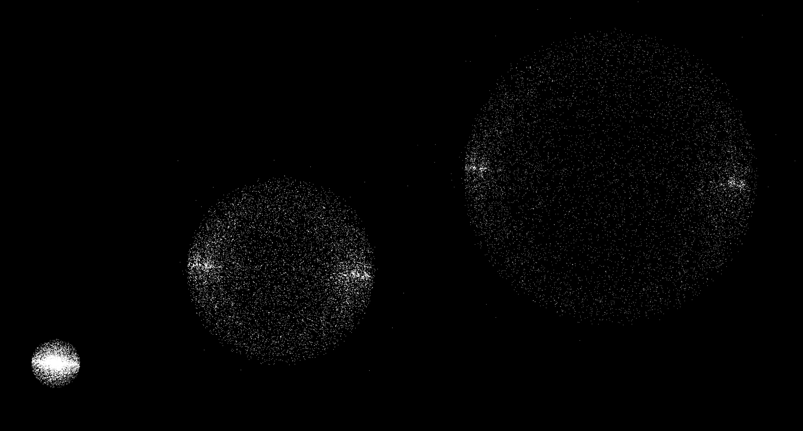
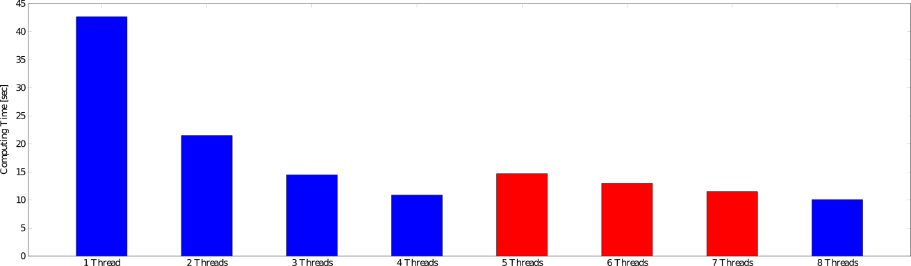

# 2> Optimizing C++ - N-Body Problem with OpenMP

In this new article, I would show how to accelerate a C++ code to solve the
N-Body problem with OpenMP. This is the first of a group of 4 articles where I
plan to show how to accelerate this algorithm starting here with OpenMP,
following by an offloading to GPUs with OpenACC, CUDA, and finalizing using the
C++ native Multi-threading feature.

The N-Body problem consists in predicting how a group of celestial objects move
in space as time passes, given certain initial positions and velocities. The
assumptions are that the only force with each object is exposed is the
gravitational force resultant of the rest of the bodies in the system. Note
that for the case where there are only two bodies (N = 2) was completely and
analytically solved by Bernoulli, not by Newton. Several attempts have been
done to obtain analytical solutions to special combinations of initial
conditions for the case N = 3 and N = 4. Mathematicians like Euler and Lagrange
give several contributions there, probably you have heard or learned before
about "The Lagrange Points" which is a special solution for the 3-Body problem
(under special initial conditions).

In this case, we are going to solve the challenging N-Body problem numerically
with a simple C++ code. Numerically means that we are computing an
approximation of the solution which accuracy relies on the numerical algorithm
and the floating-point precision used. Logically these parameters can be tuned
to get a very acceptable solution to the problem.

The algorithm that I am using is based directly on the definition of the
problem without any simplification "Compute the force over each particle
produced by the gravitational force of the other N - 1 bodies". It is clear
that the algorithm will contain two nested For-Loops of order N resulting in an
O(N^2) algorithm. We are going to assume that the N bodies have all the same
mass to facilitate the implementation of the code and make it more simple.

Before starting with the C++ technical part I will recommend to clone the
Github Repository and to take a complete look to main.cpp. This is the CPU-only
sequential version of the code that I am going to explain now. The most
important part of the code that performs the O(N^2) computations is:

```c++
void Problem::integrate()
{
	const double Const = mG * mMass * mMass;

	for (int pi = 0; pi < mNumParticles; pi++) {

		double force[3] = {};

		// Calculate total force
		for (int pj = 0; pj < mNumParticles; pj++) {

			if (pj != pi) {
				const double dij[3] = {
					mParticles[pj].pos[0] - mParticles[pi].pos[0],
					mParticles[pj].pos[1] - mParticles[pi].pos[1],
					mParticles[pj].pos[2] - mParticles[pi].pos[2]};

				const double dist2 = dij[0] * dij[0] + dij[1] * dij[1] + dij[2] * dij[2];
				const double ConstDist2 = Const / dist2;
				const double idist = 1 / sqrt(dist2);

				// F = C * m * m / ||x2 - x1||^2 * (x2 - x1) / ||x2 - x1||
				force[0] += ConstDist2 * dij[0] * idist;
				force[1] += ConstDist2 * dij[1] * idist;
				force[2] += ConstDist2 * dij[2] * idist;
			}
		}

		// dv / dt = a = F / m
		mParticles[pi].vel[0] += force[0] * mInverseMass * mDt;
		mParticles[pi].vel[1] += force[1] * mInverseMass * mDt;
		mParticles[pi].vel[2] += force[2] * mInverseMass * mDt;
	}

	// Update pos this should be done after all forces/velocities have being computed
	for (int pi = 0; pi < mNumParticles; pi++) {
		// dx / dt = v
		mParticles[pi].pos[0] += mParticles[pi].vel[0] * mDt;
		mParticles[pi].pos[1] += mParticles[pi].vel[1] * mDt;
		mParticles[pi].pos[2] += mParticles[pi].vel[2] * mDt;
	}
}

int main()
{
	const int nTimeSteps = 100;
	const double Mass = 1e12;
	const double dt = 1e-4;
	const unsigned numParticles = 10000;
	Problem problem(Mass, dt, numParticles);
	int tsp = 0;

	cout << "Number of threads : " << omp_get_max_threads() << endl;
	for (int ts = 0; ts < nTimeSteps; ts++) {
		problem.integrate();
	}
	return 0;
}
```

To see the physical solution of the N-Body problem you can uncomment the
printing lines in the main function to print the CSV files at different time
steps (you can control when you want to print each snapshot, let say after X
time steps). Also, you can set the initial condition of the particles, in my
case I set for all of them the same velocity pointing against the center of
coordinates (x=0, y=0, z=0). In the figure below it is the result that I have
obtained in three different time steps. In the beginning, they are pulled apart
from the center and, as time evolves, they desaccelerate due to the
gravitational attraction. In the meantime, they should collapse again but the
parameters should be set accordingly to produce this effect. I recommend
playing a little bit with this program to see these effects (e.g., running the
problem for more time steps to see if the particles collapse).  Phases of the N
Body problem solve with this code



Before starting the acceleration with OpenMP I would like to give a quick
introduction to it. OpenMP is a programming model which allows implementing
multi-threading programs. A programming model is not a programming language,
this means that OpenMP is applied over codes written in any programming
language (e.g.: C, C++, or Fortran). To create tasks with OpenMP additional
pragmas like:

```c++
#pragma omp parallel
{
   ...
}
```

are added into the code. The compiler (currently supported by most of the well
known: GCC, Clang, PGI, Intel, or IBM) performs the conversion of the code for
using the threads then. For our N-Body problem I have simply added:

```c++
void Problem::integrate()
{
	const double Const = mG * mMass * mMass;

#pragma omp parallel for
	for (int pi = 0; pi < mNumParticles; pi++) {

		double force[3] = {};

		// Calculate total force
		for (int pj = 0; pj < mNumParticles; pj++) {

			if (pj != pi) {
				const double dij[3] = {
					mParticles[pj].pos[0] - mParticles[pi].pos[0],
					mParticles[pj].pos[1] - mParticles[pi].pos[1],
					mParticles[pj].pos[2] - mParticles[pi].pos[2]};

				const double dist2 = dij[0] * dij[0] + dij[1] * dij[1] + dij[2] * dij[2];
				const double ConstDist2 = Const / dist2;
				const double idist = 1 / sqrt(dist2);

				// F = C * m * m / ||x2 - x1||^2 * (x2 - x1) / ||x2 - x1||
				force[0] += ConstDist2 * dij[0] * idist;
				force[1] += ConstDist2 * dij[1] * idist;
				force[2] += ConstDist2 * dij[2] * idist;
			}
		}

		// dv / dt = a = F / m
		mParticles[pi].vel[0] += force[0] * mInverseMass * mDt;
		mParticles[pi].vel[1] += force[1] * mInverseMass * mDt;
		mParticles[pi].vel[2] += force[2] * mInverseMass * mDt;
	}

	// Update pos this should be done after all forces/velocities have being computed
#pragma omp parallel for
	for (int pi = 0; pi < mNumParticles; pi++) {
		// dx / dt = v
		mParticles[pi].pos[0] += mParticles[pi].vel[0] * mDt;
		mParticles[pi].pos[1] += mParticles[pi].vel[1] * mDt;
		mParticles[pi].pos[2] += mParticles[pi].vel[2] * mDt;
	}
}
```

This example is also contained in the repository (main-omp.cpp). Note that I
have included the lines:

```c++
...

#pragma omp parallel for

 
    for (int pi = 0; pi < mNumParticles; pi++) {
         
        ...


        for (int pj = 0; pj < mNumParticles; pj++) {
              ...
        }
        
        ...
        
     }
        
        

#pragma omp parallel for

    for (int pi = 0; pi < mNumParticles; pi++) {
        ...
    }
...

```

This means that when the main process reaches that #pragma line N number of
threads are going to be created and each of them is going to compute the
solution for a subgroup of the total mNumParticles. For example, if there are
10000 particles and we execute with 4 OpenMP threads, it is very likely that
every thread computes 2500 particles.

For compiling do:

```bash
$ g++ main-omp.cpp -O3 -fopenmp
```

For executing with one thread:

```bash
$ export OMP_NUM_THREADS=1
$ time ./a.out
Number of threads : 1

real    0m42.687s
user    0m42.669s
sys     0m0.000s
```

With two threads (note that there is no need for recompiling!):

```bash
$ export OMP_NUM_THREADS=2
$ time ./a.out
Number of threads : 2

real    0m21.467s
user    0m42.908s
sys     0m0.000s
```

Note there is a perfect scaling from 1 thread to 2 threads. I am running this
case with an Intel Core i5-9300H CPU @ 2.4 GHz which has 4 cores and allows 2
threads per core. The next diagram shows the computing time using from 1 to 8
threads. Even this processor has hyperthreading, meaning that allows the
execution of more than one threads in each core, I didn't observe improvements
from 4 to 7 threads but I obtained an improvement of 1% from 4 to 8 threads:



In the next posts, I will be showing how to offload the code to GPUs with
OpenACC and CUDA and I will finalize using the native multithread library of
C++, so don't miss them ;).
