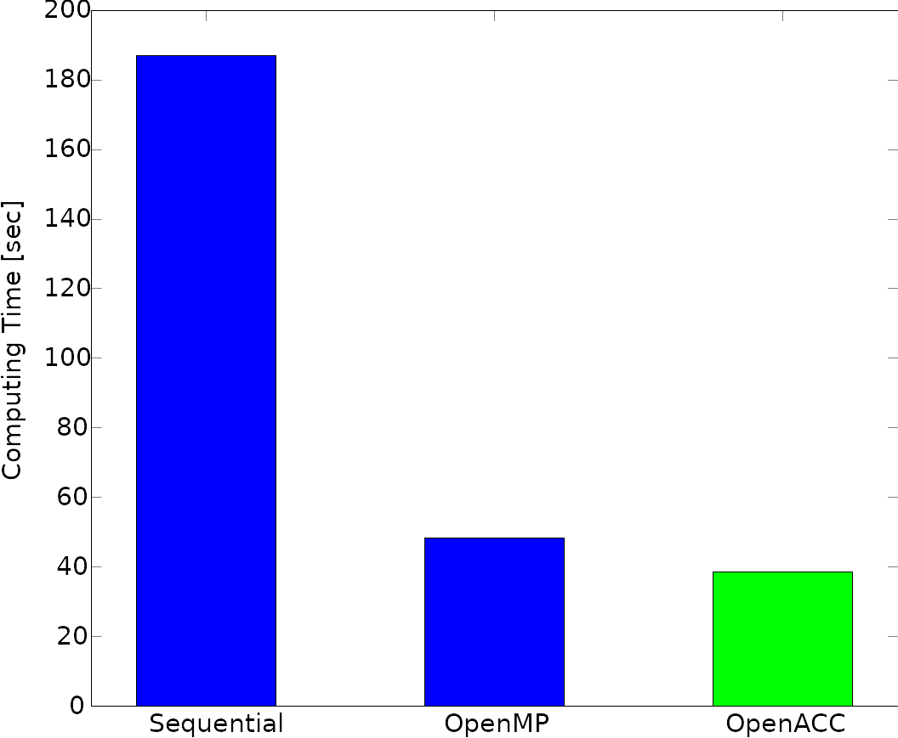

# 2> Optimizing C++ - N-Body Problem with OpenMP

In this new article, I would show how to accelerate a C++ code to solve the
N-Body problem with OpenMP. This is the first of a group of 4 articles where I
plan to show how to accelerate this algorithm starting here with OpenMP,
following by an offloading to GPUs with OpenACC, CUDA, and finalizing using the
C++ native Multi-threading feature.

The N-Body problem consists in predicting how a group of celestial objects move
in space as time passes, given certain initial positions and velocities. The
assumptions are that the only force with each object is exposed is the
gravitational force resultant of the rest of the bodies in the system. Note
that for the case where there are only two bodies (N = 2) was completely and
analytically solved by Bernoulli, not by Newton. Several attempts have been
done to obtain analytical solutions to special combinations of initial
conditions for the case N = 3 and N = 4. Mathematicians like Euler and Lagrange
give several contributions there, probably you have heard or learned before
about "The Lagrange Points" which is a special solution for the 3-Body problem
(under special initial conditions).

In this case, we are going to solve the challenging N-Body problem numerically
with a simple C++ code. Numerically means that we are computing an
approximation of the solution which accuracy relies on the numerical algorithm
and the floating-point precision used. Logically these parameters can be tuned
to get a very acceptable solution to the problem.

The algorithm that I am using is based directly on the definition of the
problem without any simplification "Compute the force over each particle
produced by the gravitational force of the other N - 1 bodies". It is clear
that the algorithm will contain two nested For-Loops of order N resulting in an
O(N^2) algorithm. We are going to assume that the N bodies have all the same
mass to facilitate the implementation of the code and make it more simple.

Before starting with the C++ technical part I will recommend to clone the
Github Repository and to take a complete look to main.cpp. This is the CPU-only
sequential version of the code that I am going to explain now. The most
important part of the code that performs the O(N^2) computations is:

```c++
void Problem::integrate()
{
	const double Const = mG * mMass * mMass;

	for (int pi = 0; pi < mNumParticles; pi++) {

		double force[3] = {};

		// Calculate total force
		for (int pj = 0; pj < mNumParticles; pj++) {

			if (pj != pi) {
				const double dij[3] = {
					mParticles[pj].pos[0] - mParticles[pi].pos[0],
					mParticles[pj].pos[1] - mParticles[pi].pos[1],
					mParticles[pj].pos[2] - mParticles[pi].pos[2]};

				const double dist2 = dij[0] * dij[0] + dij[1] * dij[1] + dij[2] * dij[2];
				const double ConstDist2 = Const / dist2;
				const double idist = 1 / sqrt(dist2);

				// F = C * m * m / ||x2 - x1||^2 * (x2 - x1) / ||x2 - x1||
				force[0] += ConstDist2 * dij[0] * idist;
				force[1] += ConstDist2 * dij[1] * idist;
				force[2] += ConstDist2 * dij[2] * idist;
			}
		}

		// dv / dt = a = F / m
		mParticles[pi].vel[0] += force[0] * mInverseMass * mDt;
		mParticles[pi].vel[1] += force[1] * mInverseMass * mDt;
		mParticles[pi].vel[2] += force[2] * mInverseMass * mDt;
	}

	// Update pos this should be done after all forces/velocities have being computed
	for (int pi = 0; pi < mNumParticles; pi++) {
		// dx / dt = v
		mParticles[pi].pos[0] += mParticles[pi].vel[0] * mDt;
		mParticles[pi].pos[1] += mParticles[pi].vel[1] * mDt;
		mParticles[pi].pos[2] += mParticles[pi].vel[2] * mDt;
	}
}

int main()
{
	const int nTimeSteps = 100;
	const double Mass = 1e12;
	const double dt = 1e-4;
	const unsigned numParticles = 10000;
	Problem problem(Mass, dt, numParticles);
	int tsp = 0;

	cout << "Number of threads : " << omp_get_max_threads() << endl;
	for (int ts = 0; ts < nTimeSteps; ts++) {
		problem.integrate();
	}
	return 0;
}
```

To see the physical solution of the N-Body problem you can uncomment the
printing lines in the main function to print the CSV files at different time
steps (you can control when you want to print each snapshot, let say after X
time steps). Also, you can set the initial condition of the particles, in my
case I set for all of them the same velocity pointing against the center of
coordinates (x=0, y=0, z=0). In the figure below it is the result that I have
obtained in three different time steps. In the beginning, they are pulled apart
from the center and, as time evolves, they desaccelerate due to the
gravitational attraction. In the meantime, they should collapse again but the
parameters should be set accordingly to produce this effect. I recommend
playing a little bit with this program to see these effects (e.g., running the
problem for more time steps to see if the particles collapse).  Phases of the N
Body problem solve with this code


Before starting the acceleration with OpenMP I would like to give a quick
introduction to it. OpenMP is a programming model which allows implementing
multi-threading programs. A programming model is not a programming language,
this means that OpenMP is applied over codes written in any programming
language (e.g.: C, C++, or Fortran). To create tasks with OpenMP additional
pragmas like:

```c++
#pragma omp parallel
{
   ...
}
```

are added into the code. The compiler (currently supported by most of the well
known: GCC, Clang, PGI, Intel, or IBM) performs the conversion of the code for
using the threads then. For our N-Body problem I have simply added:

```c++
void Problem::integrate()
{
	const double Const = mG * mMass * mMass;

#pragma omp parallel for
	for (int pi = 0; pi < mNumParticles; pi++) {

		double force[3] = {};

		// Calculate total force
		for (int pj = 0; pj < mNumParticles; pj++) {

			if (pj != pi) {
				const double dij[3] = {
					mParticles[pj].pos[0] - mParticles[pi].pos[0],
					mParticles[pj].pos[1] - mParticles[pi].pos[1],
					mParticles[pj].pos[2] - mParticles[pi].pos[2]};

				const double dist2 = dij[0] * dij[0] + dij[1] * dij[1] + dij[2] * dij[2];
				const double ConstDist2 = Const / dist2;
				const double idist = 1 / sqrt(dist2);

				// F = C * m * m / ||x2 - x1||^2 * (x2 - x1) / ||x2 - x1||
				force[0] += ConstDist2 * dij[0] * idist;
				force[1] += ConstDist2 * dij[1] * idist;
				force[2] += ConstDist2 * dij[2] * idist;
			}
		}

		// dv / dt = a = F / m
		mParticles[pi].vel[0] += force[0] * mInverseMass * mDt;
		mParticles[pi].vel[1] += force[1] * mInverseMass * mDt;
		mParticles[pi].vel[2] += force[2] * mInverseMass * mDt;
	}

	// Update pos this should be done after all forces/velocities have being computed
#pragma omp parallel for
	for (int pi = 0; pi < mNumParticles; pi++) {
		// dx / dt = v
		mParticles[pi].pos[0] += mParticles[pi].vel[0] * mDt;
		mParticles[pi].pos[1] += mParticles[pi].vel[1] * mDt;
		mParticles[pi].pos[2] += mParticles[pi].vel[2] * mDt;
	}
}
```

This example is also contained in the repository (main-omp.cpp). Note that I
have included the lines:

```c++
...

#pragma omp parallel for

 
    for (int pi = 0; pi < mNumParticles; pi++) {
         
        ...


        for (int pj = 0; pj < mNumParticles; pj++) {
              ...
        }
        
        ...
        
     }
        
        

#pragma omp parallel for

    for (int pi = 0; pi < mNumParticles; pi++) {
        ...
    }
...

```

This means that when the main process reaches that #pragma line N number of
threads are going to be created and each of them is going to compute the
solution for a subgroup of the total mNumParticles. For example, if there are
10000 particles and we execute with 4 OpenMP threads, it is very likely that
every thread computes 2500 particles.

For compiling do:

```bash
$ g++ main-omp.cpp -O3 -fopenmp
```

For executing with one thread:

```bash
$ export OMP_NUM_THREADS=1
$ time ./a.out
Number of threads : 1

real    0m42.687s
user    0m42.669s
sys     0m0.000s
```

With two threads (note that there is no need for recompiling!):

```bash
$ export OMP_NUM_THREADS=2
$ time ./a.out
Number of threads : 2

real    0m21.467s
user    0m42.908s
sys     0m0.000s
```

Note there is a perfect scaling from 1 thread to 2 threads. I am running this
case with an Intel Core i5-9300H CPU @ 2.4 GHz which has 4 cores and allows 2
threads per core. The next diagram shows the computing time using from 1 to 8
threads. Even this processor has hyperthreading, meaning that allows the
execution of more than one threads in each core, I didn't observe improvements
from 4 to 7 threads but I obtained an improvement of 1% from 4 to 8 threads:


In the next posts, I will be showing how to offload the code to GPUs with
OpenACC and CUDA and I will finalize using the native multithread library of
C++, so don't miss them ;).

# 3> Optimizing C++ - Offloading N-Body Problem to GPUs with OpenACC

Glory Moore Law days have gone. Before 2003 the number of transistors per
processor duplicated every 2 years. In those years programmers were waiting for
the next new processor with higher frequency and high memory bandwidth;
unfortunately, the physical limitations in power dissipation and leak currents
in the nanometer scale of the transistors have stopped the design basis of
increasing transistors density, reducing voltage and increasing frequency. This
has impulsed the development of new ideas in multi-core and heterogeneous
computing enabling further acceleration of software execution allowing to reach
new frontiers in floating-point point and integer operation performance.

In this case, as I have promised, I will offload the N-Body problem to GPUs
using OpenACC. For the test, I will be using my laptop which has a GeForce GTX
1050 3 GB Max-Q NVIDIA GPU and Quadcore Intel i5-9300H CPU @ 2.40GHz. As
always, you can check the original version of the code and the
optimized/accelerated version in the GitHub repository. If you have a GPU you
can also try the PGI compiler to get similar results as this article.

The first thing we have to do before starting to accelerate the code is to move
all the data possible from the host (the memory used by the CPU) to the device
(video memory of the GPU). Why? The CPU and the GPU are not in the same chip,
they are connected by a physical media, e.g. a cable and a communication
protocol (PCI express, nvlink, etc), so the time required to communicate data
from CPU to GPU and vice-versa can be comparable with the time of useful
computations or even more. For this reason, we have to avoid as much as
possible the communications to increase the computing performance, and in this
way, keeping the GPU busy and operating the whole time on the data with the
ALUs and FPUs.

For moving the data from host to device and vice-versa I have added a method to
the main class of the N-Body code called mMoveToDevice() and mMoveToHost():

```c++
void Problem::mMoveToDevice()
{
#pragma acc enter data copyin(this[0:1], mParticles[0:mNumParticles])
}

void Problem::mMoveToHost()
{
#pragma acc update self(mParticles[0:mNumParticles])
}
```

Thus before solving the time loop (most computationally intensive part), a call
to mMoveToDevice() will move the particle related data to the GPU memory which
is needed to start computing the new positions and velocities by the cores of
the device:

```c++
...

int main()
{
    problem.mMoveToDevice();

    for (int ts = 0; ts < nTimeSteps; ts++) {
         
         problem.integrate();
    }
    return 0;
}
```

You can also do a call to mMoveToHost() for moving the computed data back to
the CPU memory, e.g., for example for postprocessing and write it in a file.
Take into account that this last can significantly deteriorate the performance
of the algorithm.

Now, with the particle data stored in the GPU is possible to start integrating
the positions and velocities of the particles inside the GPU. With OpenACC it
is as easy as:

```c++
void Problem::integrate()
{


#pragma acc parallel loop present (this[0:1], mParticles[0:mNumParticles])
    for (int pi = 0; pi < mNumParticles; pi++) {

         ...

    }


#pragma acc parallel loop present (this[0:1], mParticles[0:mNumParticles])
    for (int pi = 0; pi < mNumParticles; pi++) {
   
         ...

    }

}
```

Note that we have added the decorator "present" in the pragmas to indicate to
the compiler that the data is already copied to the GPU memory. If we wouldn't
do that the compiler would generate a code which in each time step (when the
call to the integrate() function is done) which would copy data from the CPU to
the GPU adding a lot of overhead and unneeded copies. So, it is crucial to
specify that in order to maximize the throughput.

As we can see, inside the outer for-loop there are some calls to sqrt(double)
function, this is a problem since the compiler doesn't know how the threads are
going to execute it, e.g. it can be a CUDA kernel or a simple sequential
function. So for fixing this problem, we have to specify that we want to
execute sqrt(double) sequentially with one thread. The way I do this is by
using the headers provided by PGI. In this case, I have replaced the C math
library include:

```c++
#include <cmath>
```

with

```c++
#include <accelmath.h>
```

In this way, the program is going to use the PGI own implementation of the
sqrt() function, and not the one from the C math library.

PGI compiler also does not support some C++ features, for example, I had to
replace the zero initializers of the force:

```c++
double force[3] = {};
```

with

```c++
double force[3] = {0, 0, 0};
```

These issues are solved in each new version of PGI; hopefully, in some months
or years, the modern C++ standard will be supported by the compiler.

So now it is time to test if our GPU offloading works. I have modified in this
case the parameter of the simulation to 5-time steps and 100K particles to make
more significant the improvements using GPU acceleration against the CPU. I
will compare it with one-core-only and OpenMP execution. For this, I use the
OpenMP support offered by PGI compiler. Notice that I can reuse the same OpenMP
pragmas of the previous article to generate code for OpenMP and OpenACC at the
same time:

```c++
#pragma omp parallel for
#pragma acc parallel loop present (this[0:1], mParticles[0:mNumParticles])
    for (int pi = 0; pi < mNumParticles; pi++) {
         
         ...
    }
```

For the one-core-only execution, I compiled and run as:

```bash
$ pgc++ main-acc.cpp -o main-acc-cpu -O3
$ time ./main-acc-cpu

real    3m7.376s
user    3m7.258s
sys     0m0.007s
```

For OpenMP:

```bash
$ pgc++ main-acc.cpp -o main-acc-cpu-omp -O3 -mp
$ export OMP_NUM_THREADS=8
$ time ./main-acc-cpu-omp
real    0m48.323s
user    6m22.577s
sys     0m0.140s
```

And finally, for OpenACC:

```bash
$ pgc++ main-acc.cpp -o main-acc-cpu-omp -O3 -acc -Minfo=accel
$ time ./main-acc

real    0m38.461s
user    0m37.921s
sys     0m0.417s
```

As you can see, we obtained a speedup of x3.9 with OpenMP and x4.9 with
OpenACC. In the next figure we outlined these results:



In the next article, I will offload the N-Body code using CUDA, the interface
and the library provided by NVIDIA. CUDA enables much more flexibility and
control, allowing to perform better optimizations than OpenACC. The
disadvantage is that the portability of the code with CUDA is less than
OpenACC. Note that with OpenACC we had to add some simple pragmas only. In all
the cases, knowing CUDA is another weapon you can have before going to the
battlefield and it can help you to accelerate even more your software.
